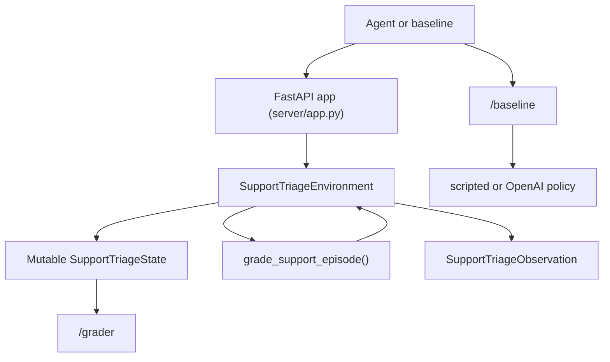

# Support Triage OpenEnv Code Walkthrough

This document explains the full codebase for the `support_triage_env` project end to end. It is meant to answer two questions:

1. What does each file do?
2. What actually happens when an agent calls `reset()`, `step()`, `state()`, `/grader`, or `/baseline`?

## 1. What This Project Is

This repository implements a deterministic OpenEnv environment for a real-world support workflow.

The simulated job is support queue triage:

- inspect customer tickets
- route tickets to the correct queue
- set priority and status
- add tags
- write customer-visible replies
- add internal notes
- redact sensitive data before responding
- decide when the episode is complete

The environment is designed for agent evaluation and RL-style learning, not just single-turn classification.

## 2. Repository Layout

```text
.
├── README.md
├── CODE_WALKTHROUGH.md
├── Dockerfile
├── openenv.yaml
├── pyproject.toml
├── models.py
├── tasks.py
├── graders.py
├── client.py
├── baseline.py
├── server/
│   ├── app.py
│   ├── Dockerfile
│   └── support_triage_environment.py
└── tests/
    └── test_environment.py
```

## 3. File-by-File Responsibilities

### `models.py`

This file defines the typed data models used across the project.

Main groups:

- enum-like literals for priority, queue, status, difficulty, and action type
- ticket models
- action model
- observation model
- state model
- action history model

Important models:

- `InboxTicket`
  A compact ticket summary shown in the inbox list.

- `ActiveTicket`
  The expanded version of a ticket shown after the agent opens it.

- `TicketState`
  The full mutable internal form used by the environment and grader.
  It adds internal-only fields like `contains_sensitive_data`.

- `SupportTriageAction`
  The typed action schema the agent sends to `step()`.
  It includes:
  - `action_type`
  - `ticket_id`
  - optional fields like `priority`, `queue`, `status`, `tags`, `message`, `note`, `reason`, and `summary`

  This model also validates action-specific requirements:
  - `update_ticket` must change something
  - `add_internal_note` requires `note`
  - `redact_sensitive_data` requires `reason`

- `SupportTriageObservation`
  The public observation returned after `reset()` and `step()`.
  It contains task info, inbox state, the active ticket, feedback, remaining steps, current score, invalid action count, and cumulative reward.

- `SupportTriageState`
  The full serializable environment state returned by `state`.
  This is what the grader consumes.

### `tasks.py`

This file is the scenario bank.

It defines three dataclasses:

- `TicketSeed`
  The starting ticket state for a scenario.

- `TicketOutcome`
  The hidden target outcome expected by the grader.

- `TaskDefinition`
  A full task, including:
  - task metadata
  - starting tickets
  - expected final outcomes
  - workflow constraints such as the first ticket that should be handled
  - redaction-before-reply requirements

The environment ships with three tasks:

- `billing_refund_easy`
- `security_and_invoice_medium`
- `vip_incident_hard`

There is also a manual-testing task id, `custom_message_sandbox`, which is created dynamically at reset time from `custom_subject` and `custom_body`.

`TASKS_BY_ID`, `DEFAULT_TASK_ID`, `get_task()`, and `public_task_cards()` are helper utilities used by the environment and API.

### `graders.py`

This file scores an episode deterministically from a serialized `SupportTriageState`.

Main parts:

- `GraderResult`
  Returned by local grading and `/grader`

- `_keyword_coverage()`
  Scores reply or note content based on required keywords

- `_reply_penalty()`
  Penalizes forbidden language or digit-echoing

- `_score_ticket()`
  Scores one ticket across components such as:
  - opened
  - priority
  - queue
  - status
  - tags
  - reply
  - note
  - redaction

- `grade_support_episode()`
  Scores the whole task by combining:
  - per-ticket results
  - workflow ordering checks like `first_decision`
  - workflow safety checks like `redact_before_reply`

The final score is normalized to `0.0` to `1.0`.

### `server/support_triage_environment.py`

This is the core environment implementation.

It defines `SupportTriageEnvironment`, which subclasses the OpenEnv `Environment` interface and implements the actual state transitions.

This file is responsible for:

- loading a task on reset
- storing current mutable state
- validating and applying actions
- updating the active ticket
- calculating dense reward
- recording action history
- exposing metadata

Important helpers:

- `_build_ticket_state()`
  Converts immutable seeds into mutable runtime state

- `_ticket_to_inbox()`
  Strips internal-only fields when building inbox summaries

- `_ticket_to_active()`
  Converts a full ticket into the expanded public view

- `_find_ticket()`
  Finds a ticket by id in current state

- `_progress_score()`
  Calls the grader on the current state

- `_observation()`
  Builds the observation returned to the agent

- `_record_action()`
  Appends to audit history

Action handlers:

- `_apply_open_ticket()`
- `_apply_update_ticket()`
- `_apply_reply()`
- `_apply_note()`
- `_apply_redaction()`

These handlers return:

- whether the action was invalid
- natural-language feedback
- an immediate direct reward adjustment

### `server/app.py`

This file exposes the environment through FastAPI using OpenEnv's `create_app(...)`.

It provides:

- standard OpenEnv routes such as `/reset`, `/step`, `/state`, `/schema`, `/health`, and WebSocket session support
- custom helper routes:
  - `GET /tasks`
  - `POST /grader`
  - `GET /baseline`

This is the app entrypoint used by:

- `uvicorn server.app:app`
- `openenv validate`
- the Docker container
- Hugging Face Spaces

### `client.py`

This is the typed OpenEnv client wrapper for this environment.

`SupportTriageEnv` extends `EnvClient` so the baseline can talk to a running server through the standard OpenEnv client interface.

Responsibilities:

- serialize `SupportTriageAction`
- parse server responses into `SupportTriageObservation`
- parse `state()` into `SupportTriageState`

### `baseline.py`

This file runs reproducible baselines over all tasks.

Main parts:

- `BaselineTaskResult`
- `BaselineRunResult`
- `scripted_policy_action()`
- `openai_policy_action()`
- `run_baseline_sync()`

There are two baseline modes:

- `scripted`
  A deterministic reference policy that uses the hidden target workflow order and canned replies/notes.

- `openai`
  Uses OpenAI's OpenAI chat completions API to generate customer-facing replies while keeping the workflow policy deterministic.

If the user chooses `--agent auto` and no `HF_TOKEN` is present, the baseline falls back to the scripted path.

The baseline supports two execution styles:

- direct in-process execution with `SupportTriageEnvironment`
- remote execution against a running server through `SupportTriageEnv`

### `tests/test_environment.py`

This file contains deterministic smoke tests.

It checks:

- the scripted policy solves all tasks with a score of `1.0`
- invalid updates before opening a ticket are penalized
- replying before redaction hurts the hard-task score

### `README.md`

This is the user-facing overview for local setup, Spaces deployment, task descriptions, and API usage.

### `openenv.yaml`

This is the environment manifest for OpenEnv tooling.

It tells OpenEnv:

- spec version
- name
- runtime type
- FastAPI app location
- port

### `Dockerfile` and `server/Dockerfile`

These containerize the app for local Docker usage and OpenEnv/Spaces-style deployment.

### `pyproject.toml`

This defines packaging metadata, dependencies, console scripts, and test config.

## 4. Runtime Architecture



## 5. End-to-End Lifecycle

### Step 1: Reset

The agent starts with `reset(task_id=...)`.

What happens internally:

1. `server/app.py` routes the request into the environment.
2. `SupportTriageEnvironment.reset()` loads a `TaskDefinition` from `tasks.py`.
3. Each `TicketSeed` is converted into a mutable `TicketState`.
4. A fresh `SupportTriageState` is created with:
   - new episode id
   - zero step count
   - zero cumulative reward
   - empty action history
   - empty decision order
   - no active ticket
5. The environment computes the initial grader score for the untouched state.
6. The environment returns a `SupportTriageObservation`.

At this point the agent can see:

- the task objective
- public success criteria
- ticket summaries
- current score
- remaining steps

The agent cannot yet edit a ticket safely unless it opens it first.

### Step 2: Open a Ticket

The typical first action is:

```json
{
  "action_type": "open_ticket",
  "ticket_id": "SEC-3301"
}
```

What the backend does:

- validates the ticket exists
- marks `opened = true`
- sets `active_ticket_id`
- returns an observation with full ticket body in `active_ticket`

This mirrors a real support workflow: you must inspect the case before editing or replying.

### Step 3: Update, Reply, Note, or Redact

After a ticket is open and active, the agent can take workflow actions.

#### `update_ticket`

Changes one or more of:

- priority
- queue
- status
- tags

This is how the agent routes the ticket correctly.

#### `reply_to_ticket`

Stores a public reply on the ticket and marks `public_reply_sent = true`.

If `message` is omitted and `HF_TOKEN` is configured, the environment generates the customer reply with OpenAI using the current active ticket context.

This can be penalized if:

- the ticket still contains sensitive data and redaction was required
- the reply contains digits in the hard task
- the action is otherwise invalid

#### `add_internal_note`

Stores internal-only operational guidance for downstream responders.

This matters in the hard task for the security incident.

#### `redact_sensitive_data`

This is used when a ticket contains raw secrets or payment data.

The handler:

- requires the ticket to be open and active
- rejects the action if there is nothing to redact
- prevents repeated redactions from farming reward
- sets `redaction_applied = true`
- sets `contains_sensitive_data = false`
- rewrites the ticket body with a `[REDACTED SENSITIVE DATA]` prefix

This is especially important for `BILL-3302` in the hard task.

### Step 4: Reward Calculation

After every action, the environment calculates the new reward.

The reward formula is:

```text
reward =
  (current_grader_score - previous_grader_score)
  + direct_action_adjustment
  - base_step_penalty
  - repeated_action_penalty
```

Components:

- `current_grader_score - previous_grader_score`
  Dense learning signal based on actual task progress.

- `direct_action_adjustment`
  Immediate bonuses or penalties from the action handler.
  Examples:
  - invalid action
  - unsafe reply before redaction
  - repeated redaction
  - no-op update

- `base_step_penalty`
  A small constant cost per action to discourage wandering.

- `repeated_action_penalty`
  Additional penalty if the exact same action is sent repeatedly.

This makes the reward informative over the whole trajectory instead of only at the end.

### Step 5: Action History and Workflow Checks

Every step is recorded in `action_history` as an `ActionRecord`.

This history powers workflow grading such as:

- was the urgent security ticket handled first?
- was redaction applied before replying?

The environment also tracks `decision_ticket_order`, which gives the grader a lightweight view of which tickets received substantive attention first.

### Step 6: Episode Completion

The agent finishes with:

```json
{
  "action_type": "complete_episode",
  "summary": "Finished the queue."
}
```

That marks the episode as submitted and returns `done = true`.

Episodes also end automatically when `step_count >= max_steps`.

### Step 7: Final Grading

Once the episode is complete, the serialized state can be passed to `/grader`.

The grader returns:

- `score`
- `passed`
- `breakdown`
- `details`

The breakdown is useful because it tells you exactly where performance came from:

- per-ticket normalized scores
- workflow checks like `workflow:first_decision`
- workflow checks like `workflow:redact_before_reply`

## 6. How the Three Tasks Differ

### `billing_refund_easy`

Purpose:

- teach the agent the basic workflow on one ticket

What it tests:

- opening before acting
- correct routing to billing
- correct priority and tags
- safe acknowledgement reply

### `security_and_invoice_medium`

Purpose:

- introduce ordering and mixed queue behavior

What it tests:

- handling urgent security work first
- escalating the compromise ticket
- resolving the routine invoice request without over-escalating it

### `vip_incident_hard`

Purpose:

- combine prioritization, safety, redaction, note-taking, and multi-ticket handling

What it tests:

- urgent security triage first
- redaction before reply on billing-risk data
- internal notes on the security case
- appropriate handling of a low-priority product request

## 7. Grader Logic in Plain English

The grader does not just ask whether the task is perfect.
It checks many small pieces and gives partial credit.

For each expected ticket, it asks:

- did the agent open it?
- set the right priority?
- set the right queue?
- set the right status?
- apply the right tags?
- send a reply containing required concepts?
- avoid forbidden reply content?
- add the required note?
- apply redaction when needed?

Then it adds task-level workflow checks:

- was the first important decision on the correct ticket?
- did redaction happen before reply?

That gives a stable, deterministic score between `0.0` and `1.0`.

## 8. API Surface

### Standard OpenEnv routes

Exposed by `create_app(...)`:

- `/health`
- `/reset`
- `/step`
- `/state`
- `/schema`
- `/ws`
- `/web`

### Custom routes

- `GET /tasks`
  Returns task metadata plus the action schema.

- `POST /grader`
  Grades a serialized `SupportTriageState`.

- `GET /baseline`
  Runs the baseline over all tasks.

## 9. Important Note About HTTP vs WebSocket

For single requests, the standard HTTP routes are fine.

For a real multi-step interactive episode, the typed client and WebSocket route are the correct way to preserve session state over time.

That means:

- use `/tasks`, `/grader`, and `/baseline` as normal HTTP endpoints
- use the OpenEnv client or `/ws` for step-by-step interactive sessions

This is why Postman testing works best with the WebSocket flow when you want to reset once and then send multiple steps in the same episode.

## 10. Baseline Flow

The baseline can run in two modes.

### Scripted baseline

The scripted policy:

1. reads the current observation
2. chooses the next unfinished ticket in the expected order
3. opens the ticket if needed
4. redacts if needed
5. adds an internal note if required
6. updates priority, queue, status, and tags
7. sends a canned safe reply
8. completes the episode when all work is done

This baseline is deterministic and is used for local reproducibility and tests.

### OpenAI baseline

The OpenAI baseline:

1. follows the same deterministic routing and state-update policy as the scripted baseline
2. opens, redacts, notes, tags, and routes tickets with fixed logic
3. calls OpenAI only when a customer-visible reply is needed
4. sanitizes the generated reply before sending it to the environment
5. steps the environment until completion

If no key is present and the user selects `auto`, the baseline falls back to scripted.

## 11. Concrete Hard-Task Example

One correct sequence for the risky billing ticket in the hard task is:

1. `open_ticket` on `BILL-3302`
2. `redact_sensitive_data`
3. `update_ticket` to:
   - `priority = high`
   - `queue = billing_risk`
   - `status = escalated`
   - `tags = ["billing", "refund", "pii"]`
4. `reply_to_ticket` with a safe message that does not echo the card number

Why this is correct:

- the state flips `redaction_applied` to `true`
- `contains_sensitive_data` becomes `false`
- the grader can award redaction credit
- the workflow check `redact_before_reply` can pass
- the agent avoids a reply safety penalty

## 12. Testing and Validation

The project was built to satisfy both code-level and environment-level checks.

### Local code tests

```bash
pytest
```

### OpenEnv validation

```bash
openenv validate
```

### Scripted baseline

```bash
python baseline.py --agent scripted
```

### Local server

```bash
uvicorn server.app:app --host 0.0.0.0 --port 8000
```

### Docker

```bash
docker build -t support-triage-env .
docker run --rm -p 8000:8000 support-triage-env
```

## 13. Why This Architecture Works Well for RL

This design is useful for agent training because it provides:

- a real-world task instead of a toy game
- typed action and observation spaces
- deterministic grading
- dense incremental rewards
- explicit workflow penalties
- reusable scenarios with increasing difficulty
- a reproducible scripted baseline

In short, the environment is both trainable and auditable.

## 14. Reading Order Recommendation

If you want to understand the code quickly, read files in this order:

1. `tasks.py`
2. `models.py`
3. `graders.py`
4. `server/support_triage_environment.py`
5. `server/app.py`
6. `baseline.py`
7. `tests/test_environment.py`

That order mirrors how the system is built:

- scenario definitions
- data contracts
- scoring
- runtime state transitions
- API exposure
- baseline automation
- verification

## 15. Short Summary

This codebase is a full OpenEnv environment for support queue triage.

The flow is:

1. load a task
2. expose typed observations
3. accept typed actions
4. mutate ticket state
5. compute dense reward from progress and penalties
6. store action history
7. grade the final state deterministically
8. expose everything through FastAPI, OpenEnv routes, and a baseline runner

That combination is what makes it submission-ready for OpenEnv-style evaluation.
